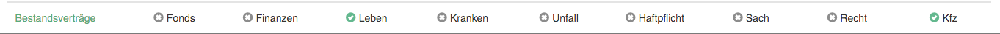

# Vertragsanbindung

Die LAS Anwendung muss dem Sachbearbeiter einen direkten Überblick für einen Kunden geben können so dass der Sachbearbeiter direkt sehen kann ob ein Kunde weitere Verträge in anderen Sparten hat oder nicht.

Im Rahmen des SPA PoC wurde hierzu die `LasFooterComponent` implementiert. Die Komponente empfängt die von der REST API bereitgestellten Metadaten zu den Verträgen des Kunden und zeigt dem Sachbearbeiter basierend darauf an, in welchen Sparten der aktuell geöffnete Kunde Verträge bei der LVM abgeschlossen hat.

