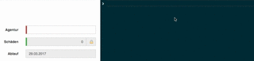

#Freischalten gesperrter Felder

Einige Felder der Anwendung sollen lediglich nach expliziter Freigabeanforderung vom Bearbeiter anpassbar sein. Hierbei kann eine beliebige Logik vom Server angesprochen werden um festzustellen ob der aktuelle Anwender das Feld bearbeiten darf oder nicht.

Im Rahmen des PoC wurde ein solches 'gesperrtes' Feld exemplarisch im UseCase **Neues Angebot erstellen** implementiert.

Es wurde eine wiederverwendbare Komponente `LvmLockedControl` erstellt, welche es dem Anwendungsentwickler ermöglicht beliebige Felder nur nach expliziter Freischaltungsanfrage des Benutzers in den Editiermodus zu versetzen.

Die API des `LvmLockedControl`'s bedarf keiner weiteren Programmierung, es muss lediglich das benötigte Markup für das Eingabefeld erstellt werden

```
<lvm-locked-control [caption]="'Schäden'">

    <input type="text" class="form-control" />

</lvm-locked-control>
```

Die Komponente selbst kümmert sich um die Freigabe des Feldes. Die API des PoC stellt keine Schnittstelle zur Prüfung der Freigabe bereit, daher wird das Feld direkt nach Anfrage des Benutzers für die Bearbeitung freigegeben. Eine eventuelle Integration einer auf dem Server bereitgestellten Schnittstelle kann in der Methode `unlockControl` vorgenommen werden. Exemplarisch wird im aktuellen Stand des PoC hier eine einfache Ausgabe in der Browser Console vorgenommen. Für den Anwender wird ein **gesperrtes Feld** wie folgt dargestellt


