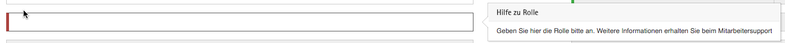

Dem Anwender soll für jedes Eingabefeld eine individuelle Hilfe angeboten werden können. Der Anwender kann die feldspezifische Hilfe mittels `F1` aufrufen, die Hilfestellung wird unmittelbar neben dem aktuell selektierten Feld dargestellt so dass der Anwender unmittelbar sehen kann welche Intention das Feld hat oder wie die erwartete Eingabe aussieht.

Im Rahmen des PoC hat die Thinktecture AG hier bereits eine exemplarische Implementierung vorgenommen. Visuell wurde die sogenannte `popover` Komponente aus dem vorhandenen CSS Framework als Grundlage für das Hilfesystem verwendet. Für den Anwendungsentwickler stellt der PoC bereits eine entsprechende `Direktive` bereit.



Der Entwickler kann die feldspezifische Hilfe entweder direkt mit der Felddefinition angeben oder den Hilfetext bei Bedarf asynchron von einem entfernten Server laden.

Eine exemplarische Implementierung ist im UseCase **Neues Angebot erstellen** zu finden.

```
<lvm-control [caption]="'Rolle'"
             [helpCaption]="'Hilfe zu Rolle'"
             [helpText]="'Geben Sie hier die Rolle bitte an. Weitere Informationen erhalten Sie beim Mitarbeitersupport'">

                <input type="text"
                  help
                  class="form-control"
                  data-field-id="customer.rolle"
                  [(ngModel)]="offer.rolle"
                  required />

            </lvm-control>
```

Durch das Attribut `helpCaption` kann die Überschrift des `popovers` angegeben werden, `helpText` stellt den eigentlichen Hilfetext dar.

Das zugrundeliegende Eingabefeld muss über das `help` Attribut verfügen, welches die Tastaturbedienbarkeit für die Hilfe bereitstellt.

