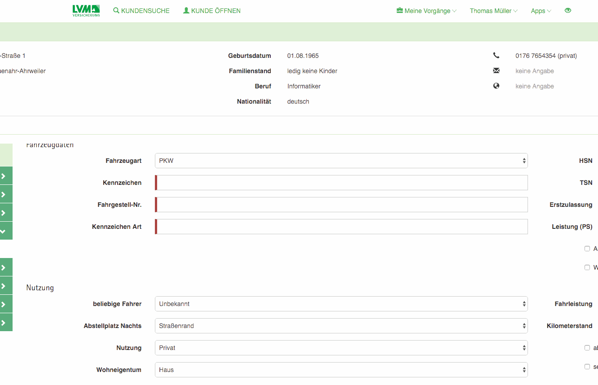

# Kunde schaut mit auf Anwendung

Bestimmte Felder der Anwendung sollen ausgeblendet werden können, damit Sachbearbeiter vor Ort dem Kunden das aktuelle Angebot präsentieren können und hierbei interne Daten nicht für den Endkunden sichtbar sind.

Im Rahmen des PoC wurde dies exemplarisch im UseCase **Neues Angebot erstellen** implementiert. Die Anwendung bietet dem Sachbearbeiter die Möglichkeit jederzeit in den **Privacy Modus** zu wechseln. Sämtliche getätigten Eingaben in allen Eingabefeldern bleiben hierbei bestehen (unabhängig der Tatsache ob das zugrundeliegende Feld im Privacy Modus sichtbar ist oder nicht).
Im Header Bereich der Anwendung kann der Sachbearbeiter den Privacy Modus aktivieren oder deaktivieren durch einen Klick auf den Privacy Modus Button


Die Schaltfläche färbt sich rot, wenn der Privacy Modus aktiv ist. Alle Felder die als **protected** markiert sind werden hierbei ausgeblendet. Die wiederverwendbare Komponente `lvm-control` bietet mit der Input-Property `isProtected` eine einfache API hierzu.

```
<lvm-control
  [caption]="'Wohneigentum'"
  [isProtected]="isProtected">

     <select
       class="form-control"
       [(ngModel)]="offer.nutzung.wohneigentumart">
          <option value="Wohnung">Wohnung</option>
          <option value="Haus">Haus</option>
     </select>
</lvm-control>
```

Damit das gesamte Formular auf den Privacy Modus reagieren kann muss eine `boolsche` Eigenschaft veröffentlicht werden (hier das Feld `isProtected`)

In der TypeScript Klasse `NewOffer` (`app/components/customer/newoffer/newoffer.ts`) ist die Eigenschaft wie folgt definiert

```
public get isProtected(): boolean {
  return this._dataProtectionService.isProtected;
}
```

Der an dieser Stelle verwendete `DataProtectionService` stellt einen anwendungsweiten Dienst dar, welcher den Privacy Modus koordiniert.

Um eine komponentenübergreifende Funktionalität zu gewährleisten wird der `InteractionService` verwendet um den Privacy Modus umzuschalten. Dadurch kann sichergestellt werden dass die Komponenten unabhängig voneinander bleiben und das System keine feste Kopplung benötigt um solche Features abbilden zu können.

Die implementierte Lösung präsentiert sich dem Anwender wie in der folgenden Animation dargestellt.


